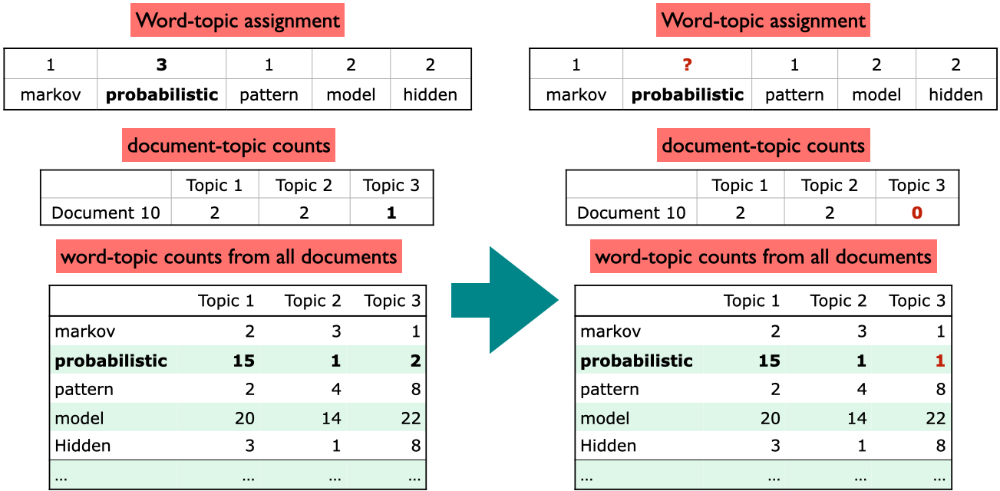
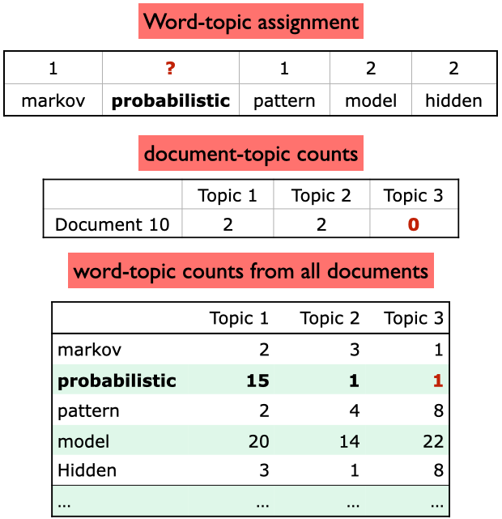
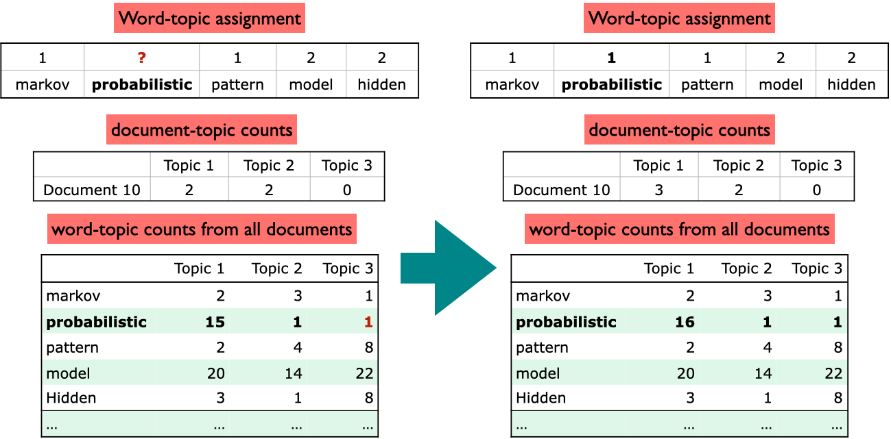

# Lecture 5: Topic Modeling

## Topic Modeling

- **Motivation**:
  - Humans are good at identifying topics in documents.
  - But, it is difficult to do this at scale. (e.g., 1000s of documents)

### How to do Topic Modeling?

- Common to use unsupervised learning techniques
  - Given hyperparameter $K$, we want to find $K$ topics.
- In unsupervised, a common model:
  - Input:
    - $D$ documents
    - $K$ topics
  - Output:
    - Topic-word association: for each topic, what words describe that topic?
    - Document-topic association: for each document, what topics are in that document?
- Common approaches:
  1. **Latent Semantic Analysis (LSA)**
  2. **Latent Dirichlet Allocation (LDA)**

### Latent Semantic Analysis (LSA)

- Singular Value Decomposition (SVD) of the term-document matrix. See [LSA notes from 563](https://mds.farrandi.com/block_5/563_unsup_learn/563_unsup_learn#lsa-latent-semantic-analysis).

$$X_{n \times d} \approx Z_{n \times k}W_{k \times d}$$

- $n$: number of documents, $d$: number of words, $k$: number of topics

```python
from sklearn.pipeline import make_pipeline
from sklearn.decomposition import TruncatedSVD
from sklearn.feature_extraction.text import CountVectorizer

lsa_pipe = make_pipeline(
    CountVectorizer(stop_words="english"), TruncatedSVD(n_components=3)
)

Z = lsa_pipe.fit_transform(toy_df["text"]);
```

### Latent Dirichlet Allocation (LDA)

- Bayesian, generative, and unsupervised model
- Developed by [David Blei](https://www.cs.columbia.edu/~blei/) and colleagues in 2003
  - One of the most cited papers in computer science
- **Document-topic distribution** or **topic proportions** $\theta$:
  - Each document is considered a mixture of topics
- **Topic-word distribution**:
  - Each topic is considered a mixture of words
  - This is from all documents

#### High-level LDA Algorithm

0. Set the number of topics $K$
1. Randomly assign each word in each document to a topic
2. For each document $d$:
   - Choose a distribution over topics $\theta$ from a **Dirichlet prior**
     - Use **dirichlet** distribution because it is conjugate priot (same form as posterior)
   - For each word in the document:
     - Choose a topic from the document's topic distribution $\theta$
     - Choose a word from the topic's word distribution
       </br>

- Fit using Bayesian inference (most commonly MCMC)

#### Gibbs Sampling

- A Markov Chain Monte Carlo (MCMC) method
- Very accurate, but slow (alternative is **Variational Inference**, which is faster but less accurate)
- Used to approximate the posterior distribution for document-topic and topic-word distributions
- **Main steps**:

  1. **Initialization**: Randomly assign each word in each document to a topic
     
  2. **Update topic-word assignments**:

     - Decrease count of current word in both topic and document distributions
     - Reassign word to a new topic based on probabilities
        

  3. **Iterate** until convergence
     

### Topic Modeling in Python

- 3 Main components:
  1. Preprocess corpus
  2. Train LDA (use `sklearn` or `gensim`)
  3. Interpret results

#### Preprocess Corpus

- Crucial to preprocess text data before training LDA
- Need tokenization, lowercasing, removing punctuation, stopwords
- Optionally, lemmatization or POS tagging

```python
import spacy

nlp = spacy.load("en_core_web_md")

def preprocess_spacy(
    doc,
    min_token_len=2,
    irrelevant_pos=["ADV", "PRON", "CCONJ", "PUNCT", "PART", "DET", "ADP"],
):
  """
  Preprocess a document using spaCy
  [Tokenize, remove stopwords, minimum token length, irrelevant POS tags, lemmatization]
  """
    clean_text = []

    for token in doc:
        if (
            token.is_stop == False  # Check if it's not a stopword
            and len(token) > min_token_len  # Check if the word meets minimum threshold
            and token.pos_ not in irrelevant_pos
        ):  # Check if the POS is in the acceptable POS tags
            lemma = token.lemma_  # Take the lemma of the word
            clean_text.append(lemma.lower())
    return " ".join(clean_text)

wiki_df = [preprocess_spacy(doc) for doc in nlp.pipe(wiki_df["text"])]
```

#### Train LDA

- With `sklearn`:

```python
from sklearn.feature_extraction.text import CountVectorizer
from sklearn.decomposition import LatentDirichletAllocation

vectorizer = CountVectorizer()
dtm = vectorizer.fit_transform(wiki_df["text_pp"])

n_topics = 3
lda = LatentDirichletAllocation(
    n_components=n_topics, learning_method="batch", max_iter=10, random_state=0
)
document_topics = lda.fit_transform(dtm)

# Get the topic-word distribution
sorting = np.argsort(lda.components_, axis=1)[:, ::-1]
feature_names = np.array(vectorizer.get_feature_names_out())
```

- With `gensim`:

```python
import gensim
from gensim.corpora import Dictionary
from gensim.models import LdaModel

corpus = [doc.split() for doc in wiki_df["text_pp"].tolist()]
dictionary = Dictionary(corpus) # Create a vocabulary for the lda model

# Get document-term matrix
doc_term_matrix = [dictionary.doc2bow(doc) for doc in corpus]

# Train LDA model
num_topics = 3

lda = LdaModel(
    corpus=doc_term_matrix,
    id2word=dictionary,
    num_topics=num_topics,
    random_state=42,
    passes=10,
)
```

- Main hyperparameters read more about them in the [documentation](https://radimrehurek.com/gensim/models/ldamodel.html)
  - `num_topics`/ `K`: number of topics
  - `alpha`: Prior on document-topic distribution
    - High alpha: documents are likely to be a mixture of many topics
    - Low alpha: documents are likely to be a mixture of few topics
  - `eta`: Prior on topic-word distribution
    - High eta: topics are likely to be a mixture of many words
    - Low eta: topics are likely to be a mixture of few words

#### Interpret Results

- Since this is unsupervised, we need to interpret the topics ourselves
- Idea is to tell a story to humans and what we should care about and evaluate
- **Common methods**:
  - Look at the top words in each topic and make judgements
    - **Word Intrusion**: Add a random word to the top words and see if it is noticed
  - Extrinsic evaluation: Evaluate whether topic nodel with current hyperparameters improves the results of task or not
  - Quantify topic interpretability with metrics like **Coherence Score**
    - Use `Gensim`'s `CoherenceModel` to calculate coherence score
    - Score is between -1 and 1, higher is better
