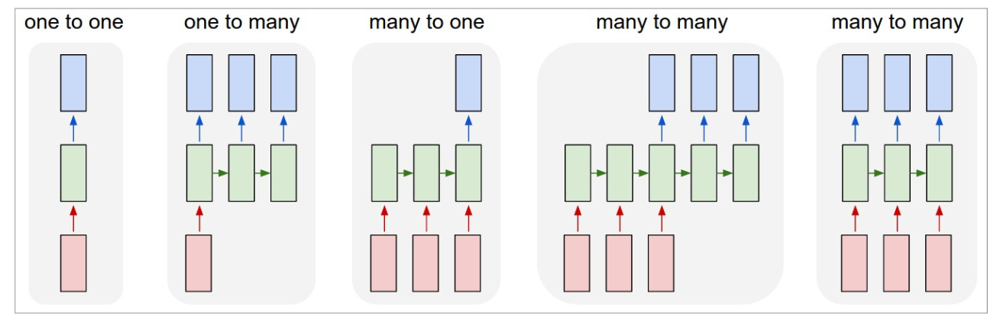

# Lecture 6: Recurrent Neural Networks (RNNs)

## Recurrent Neural Networks (RNNs)

### Motivation

- Recall when modelling sequences:
  - Order matters
  - Sequence length can vary
  - Need to capture long-term dependencies
- **Problem with Markov models**:
  - Only capture short-term dependencies
  - Sparsity problem: if there are a lot of states, the transition matrix will be very sparse
  - Also need large memory to store the n-grams
  - MM do not scale well
- To get closer to the ideal language model (closer to ChatGPT), here we will learn **neural sequencing models**.
- **Problem with Feedforward Neural Networks**:
  - Lose temporal information
  - All connects are fully connected and flow forward (no loops)

### Introduction to RNNs

- **RNNs** are a type of neural network that can model sequences
  - Similar to NN, it is supervised learning
- Solves the limited memory problem of Markov models
  - Memory only scales with number of words $O(n)$
- They use **recurrent connections** to maintain a state over time.
  
  _source: [Stanford CS224d slides](https://cs224d.stanford.edu/lectures/CS224d-Lecture8.pdf)_
- Connect the hidden layer to itself

```python
# Pseudocode for RNN
rnn = RNN()
ff = FeedForwardNN()

hidden_state = [0, 0, 0] # depenpent on the number of hidden units
for word in input:
    output, hidden_state = rnn(word, hidden_state)

prediction = ff(hidden_state)
```


_source: [Video on RNN](https://www.youtube.com/watch?v=LHXXI4-IEns&t=585s)_

- The states above are hidden layers in each time step
  - Similar to HMMs, but state is continuous, high dimensional, and much richer
- Each state contains information about the whole past sequence
- Not that different from feedforward NNs
  - Still does forward calculation
  - Just have new set of weights $U$ that connect previous hidden state to current hidden state
  - These weights are also trained via backpropagation

### Parameters in RNNs

- There are 3 weight matrices in RNNs:
  - **$W$: input -> hidden**
    - size: $d_{\text{input}} \times d_{\text{hidden}}$
  - **$V$: hidden -> output**
    - size: $d_{\text{hidden}} \times d_{\text{output}}$
  - **$U$: hidden -> hidden**
    - size: $d_{\text{hidden}} \times d_{\text{hidden}}$
- **Important point**: All weights between time steps are shared
  - Allows model to learn patterns that are independent of their position in the sequence

### Forward Pass


- Computing new state $h_t$:
  - $h_t = g(Uh_{t-1} + Wx_t + b_1)$
    - $g()$: activation function
    - $x_t$: input at time $t$
    - $b_1$: bias
- Computing output $y_t$:
  - $y_t = \text{softmax}(Vh_t + b_2)$

#### Forward Pass with PyTorch

```python
import torch
import torch.nn as nn
from torch.nn import RNN

INPUT_SIZE = 20
HIDDEN_SIZE = 10
NUM_LAYERS = 1 # number of hidden layers

rnn = nn.RNN(INPUT_SIZE, HIDDEN_SIZE, NUM_LAYERS)

h0 = torch.randn(NUM_LAYERS, HIDDEN_SIZE) # initial hidden state

# PyTorch gives output and hidden state
output, hn = rnn(input, h0)
```

Simple Sentiment RNN Class:

```python
class SentimentRNN(nn.Module):
    def __init__(self, vocab_size, embedding_dim, hidden_dim, output_dim):

        super(SentimentRNN, self).__init__()

        self.embedding = nn.Embedding(vocab_size, embedding_dim)
        self.rnn = nn.RNN(embedding_dim, hidden_dim, batch_first=True)
        self.fc = nn.Linear(hidden_dim, output_dim)

    def forward(self, text):
        embedded = self.embedding(text)
        output, hidden = self.rnn(embedded)
        assert torch.equal(output[:, -1, :], hidden.squeeze(0))
        return self.fc(hidden.squeeze(0))

# Example usage
model = SentimentRNN(vocab_size=vocab_size, embedding_dim=100, hidden_dim=128, output_dim=2)
```

#### Training RNNs

- Since it is supervised, we have: training set, loss function, and backpropagation
- Need to tailor backpropagation for RNNs
  - Since hidden layers are connected to themselves, we need to backpropagate through time
  - **Backpropagation Through Time (BPTT)**
    - Unroll the RNN for a fixed number of time steps
    - Calculate the loss at each time step
    - Sum the losses and backpropagate
    - Update the weights
  - See [the code](https://gist.github.com/karpathy/d4dee566867f8291f086) for the code implementation by Andrej Karpathy

### RNN Applications

Possible RNN architectures:


- **Sequence Labelling**:
  - E.g. Named Entity Recognition (NER) or Part-of-Speech (POS) tagging
  - Many-to-many architecture
  - Input are pre-trained word embeddings, outputs are tag probabilities by softmax
- **Sequence Classification**:
  - E.g. Spam detection or sentiment analysis
  - Similar to pseudo-code above, feed result of last hidden layer to a feedforward NN
  - Many-to-one architecture
- **Text Generation**:
  - E.g. ChatGPT
  - One-to-many architecture
  - Input is a seed, output is a sequence of words
- **Image captioning**:
  - E.g. Show and Tell
  - Many-to-many architecture
  - Input is an image, output is a sequence of words

### Stacked RNNs

- Use _sequence of outputs_ from one RNN as the _sequence of inputs_ to another RNN
- Generally outperform single-layer RNNs
- Can learn different level of abstraction in each layer
- Number of layers is a hyperparameter, remember that higher also means more training cost

### Bidirectional RNNs

- Use case is in POS tagging it is useful to know words both before and after the current word
- Bidirectional RNNs have two hidden layers, one for forward and one for backward
  - Combines two independent RNNs

### Problems with RNNs

3 Main problems:

1. **Hard to remember relevant information**
   - Vanishing gradients because of long sequences
   - Case example: `The students in the exam where the fire alarm is ringing (are) really stressed.`
     - Need to retain information that students are plural so use "are"
2. **Hard to optimize**
3. **Hard to parallelize**
