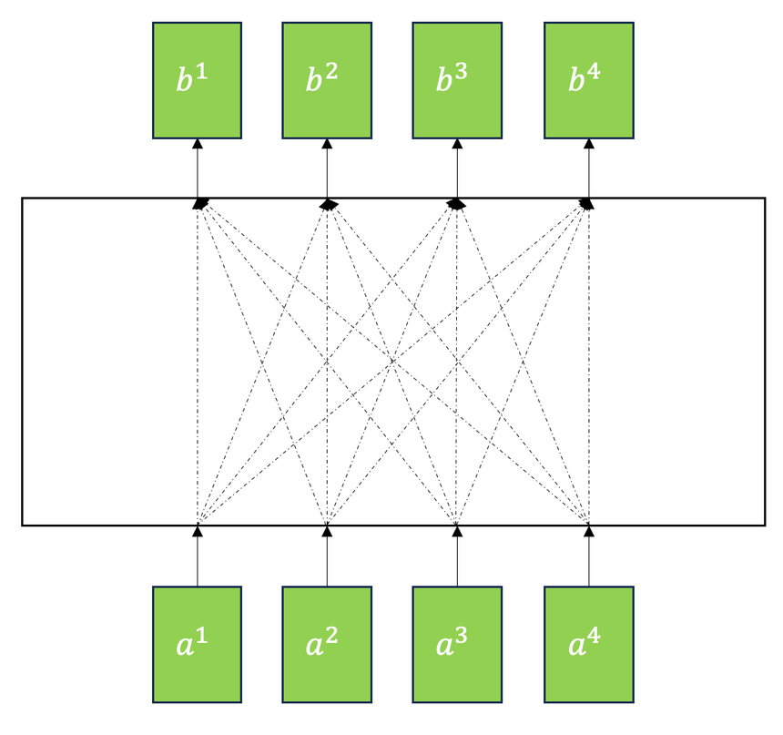
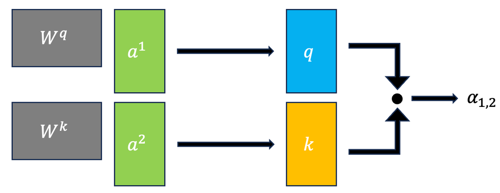
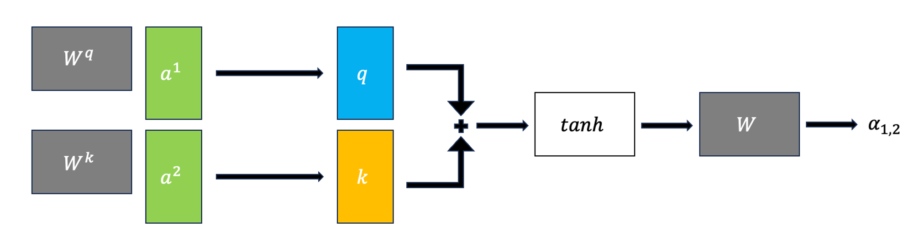
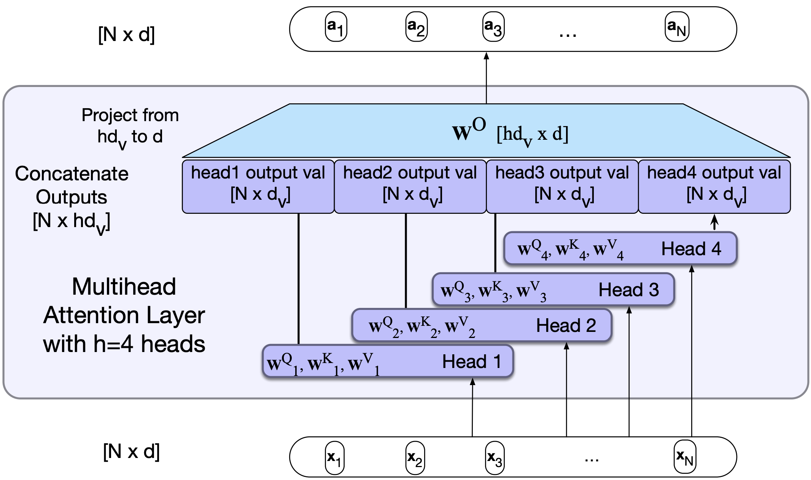
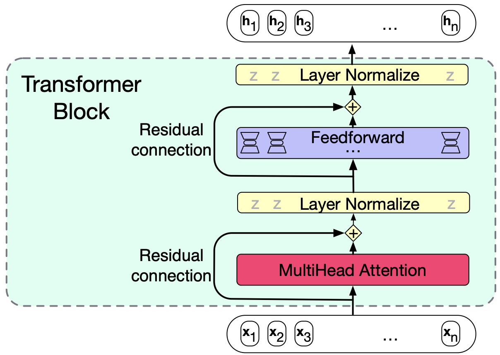

# Lecture 7: Self Attention and Transformers

## Transformers

### Intuition for Transformers

- Approach to sequence processing without using RNNs or LSTMs
- **Idea**: Build up richer and richer **contextual representations** of words across series of transformer layers
  - **Contextual representation**: Representation of a word that depends on the context in which it appears
- GPT-3: 96 layers of transformers
- **Benefits**:
  - **Parallelization**: Can process all words in parallel
  - **Long-range dependencies**: Can learn dependencies between words that are far apart
- **Two main components**:
  - **Self-attention mechanism**
  - **Positional embeddings/encodings**

### Self-Attention Mechanism

- **Goal**: To look broadly into the context and tells us how to integrate the representations of context words to build representation of a word
- **Idea**: Compute attention scores between each pair of words in a sentence
  - **Attention score**: How much one word should focus on another word
- **Example**: "She plucked the guitar strings , ending with a melancholic note."
  - Attention score from `note` to `she` is low
  - Attention score from `note` to `guitar` is high
  - Attention score from `note` to `melancholic` is very high

#### High-Level Overview

The basic steps of the self-attention mechanism are as follows:

1. Compare each word to every other word in the sentence (usually by **dot product**)
2. Apply softmax to derive a probability distribution over all words
3. Compute a weighted sum of all words, where the weights are the probabilities from step 2

- Operations can be done in parallel

#### Query, Key, Value

- **Query** $W^Q$: Word whose representation we are trying to compute (**current focus of attention**)
- **Key** $W^K$: Word that we are comparing the query to
- **Value** $W^V$: Word that we are trying to compute the representation of (output for the **current focus of attention**)

- We can assume all of them have dimension ... [TODO]

#### Self-Attention Architecture

_All diagrams in this section is made by my friend Ben Chen. Check out his [blog on self-attention](https://benchenblog.notion.site/Inside-the-Black-Box-of-Self-attention-b0feb3a57b51463f907a643468e4912d)._

- All inputs $a_i$ are connected to each other to make outputs $b_i$
  
- This is a breakdown of how each input $a_i$ is connected to each output $b_i$ using the query, key, and value
  

  - In the example our **query is $a_1$**, and our keys are $a_2$, $a_3$, and $a_4$

_Note_: For LLMs, not all the sequences are connected to each other, only words before the current word are connected to the current word.

##### Breakdown of the steps

1. Get the $\alpha$ values

   - Can either do a dot product approach (more common)
     

   - Or an additive approach with an activation function (like tanh)
     

2. Apply softmax to get $\alpha'$ values

3. Multiply $\alpha'$ values by the matrix product $W^V \cdot A$ to get the output $b_1$

##### Scaling the Dot Product

- Result of the dot product can be very large
- They are scaled before applying softmax
- Common scaling: $score(x_i, x_j) = \frac{x_i \cdot x_j}{\sqrt{d}}$
  - $d$: Dimensionsionality of the query and key vectors

#### The Steps in Matrix Form

Let $X$ be matrix of all input $x_i$ vectors (Shape: $N \times d$)

- $Q_{N \times d_k} = X \cdot W^Q_{d \times d_k}$
- $K_{N \times d_k} = X \cdot W^K_{d \times d_k}$
- $V_{N \times d_v} = X \cdot W^V_{d \times d_v}$

We can then get $\alpha$ easily by $Q \times K$ (shape: $N \times N$)

- Recall $N$ is the number of words in the sentence

Then to get the $\text{Self Attention}(Q,K,V) = \text{softmax}(\frac{Q \times K}{\sqrt{d_k}}) \times V$

But for LLMs, we only want to look at the words before the current word, so:

### Positional Embeddings

- Using self-attention mechanism, we can learn dependencies between words, but we lose the order of words
- **Solution**: Add positional embeddings to the input embeddings
  - **Positional embeddings**: Embeddings that encode the position of a word in a sentence

### Multi-Head Attention

- Different words in a sentence can relate to each other in different ways simultaneously
  - e.g. "The cat was scared because it didn't recognize me in my mask"
- Single attention layer might not be able to capture all these relationships
- Transformer uses multiple attention layers in parallel

  - Each layer is called a **head**
  - Each head learns different relationships between words

[source](https://web.stanford.edu/~jurafsky/slp3/9.pdf)

### Transformer Blocks

- Each Transformer block consists of:
  - **Multi-head self-attention layer**
  - **Feed-forward neural network**:
    - $N$ network
    - 1 hidden layer (normally higher dimensionality than input), 2 weight matrices
  - **Residual connections**
    - Add some "skip" connections because improves learning and gives more information to the next layer
  - **Layer normalization**
    - Similar to `StandardScaler`, make mean 0 and variance 1
    - To keep values in a certain range

$$
  T^1 = \text{SelfAttention}(X)\\
  T^2 = X + T^1\\
  T^3 = \text{LayerNorm}(T^2)\\
  T^4 = \text{FFN}(T^3)\\
  T^5 = T^4 + T^3\\
  H = \text{LayerNorm}(T^5)
$$

- Input and Output dimensions are matched so they can be "stacked"

#### Transformer in LLMs

- Take output of $h_N$ and get logit vector of shape $1 \times V$ where $V$ is the vocabulary size
  - $h_N$ -> unembedding layer -> logit vector -> softmax -> probability distribution
- This probability distribution is used to predict the next word
