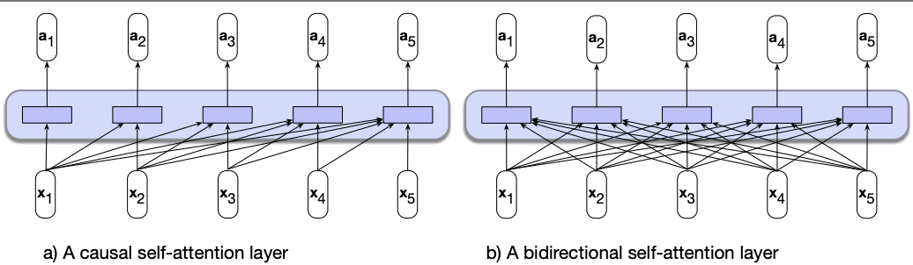

# Lecture 8: More Transformers

## Types of Transformers

1. **Decoder-only Transformer**
   - **Example**: GPT-3
   - **Training**: Trained on unsupervised data
   - **Use case**: Language modeling, text generation
2. **Encoder-only Transformer**
   - **Example**: BERT
   - **Training**: Trained on supervised data
   - **Use case**: Text classification, question answering, sentiment analysis
3. **Encoder-Decoder Transformer**
   - **Example**: T5, BART
   - **Training**: Trained on supervised data
   - **Use case**: Machine translation, summarization

### Decoder-only Transformer

- **Training**: Segment corpus of text into input-output pairs
- To predict the next word, given input words
- Self-attention only sees words before the current word
  - Use a **causal mask** to prevent the model from looking at future words

#### Autoregressive text generation

- Once trained, can generate text autoregressively
  - Incrementally generating words by sampling the next word based on previous choices
  - Sampling part is similar to generation with Markov models (but with more context and long-range dependencies)

### Encoder-only Transformer

- Mainly designed for a wide range of NLP tasks (e.g., text classification)
- It has **bidirectional self-attention**
  - Can look at all words in a sentence
  - Can learn dependencies between words in both directions
    
- **Training**:
  - **"fill in the blank" tasks/ cloze tasks**
    - Model predicts the probability of missing words in a sentence, use cross-entropy loss
  - Mask tokens and learn to recover them
  - **Contextual embeddings**: representations created by masked language models
    - Different to single vector embeddings from word2vec
    - Each word has a different vector depending on the context
- **Transfer learning through fine-tuning**:
  - GPT and BERT models are pre-trained on large corpora (very general)
  - Can create interfaces from these models to downstream tasks
  - Either freeze training or make minor adjustments to the model

### Encoder-Decoder Transformer

- For machine translation, summarization, etc.
- **High level architecture**:
  - **Encoder**: Takes input text and creates a representation
    - Similar transformer blocks as in the encoder-only transformer
  - **Decoder**: Takes the representation and generates the output text
    - More powerful block with extra cross-attention layer that can attend to all encoder words
  - **Attention mechanism**: Helps the decoder focus on different parts of the input text

### Interim Summary

| Feature                        | Decoder-only (e.g., GPT-3)                                             | Encoder-only (e.g., BERT, RoBERTa)                                         | Encoder-decoder (e.g., T5, BART)                                                                                  |
| ------------------------------ | ---------------------------------------------------------------------- | -------------------------------------------------------------------------- | ----------------------------------------------------------------------------------------------------------------- |
| Contextual Embedding Direction | Unidirectional                                                         | Bidirectional                                                              | Bidirectional                                                                                                     |
| Output Computation Based on    | Information earlier in the context                                     | Entire context (bidirectional)                                             | Encoded input context                                                                                             |
| Text Generation                | Can naturally generate text completion                                 | Cannot directly generate text                                              | Can generate outputs naturally                                                                                    |
| Example                        | MDS Cohort 8 is the \_\_\_                                             | MDS Cohort 8 is the best! → positive                                       | Input: Translate to Mandarin: MDS Cohort 8 is the best! Output: MDS 第八期是最棒的!                               |
| Usage                          | Recursive prediction over the sequence                                 | Used for classification tasks, sequence labeling taks and many other tasks | Used for tasks requiring transformations of input (e.g., translation, summarization)                              |
| Textual Context Embeddings     | Produces unidirectional contextual embeddings and token distributions  | Compute bidirectional contextual embeddings                                | Compute bidirectional contextual embeddings in the encoder part and unidirectional embeddings in the decoder part |
| Sequence Processing            | Given a prompt $X_{1:i}$, produces embeddings for $X_{i+1}$ to $X_{L}$ | Contextual embeddings are used for analysis, not sequential generation     | Encode input sequence, then decode to output sequence                                                             |
