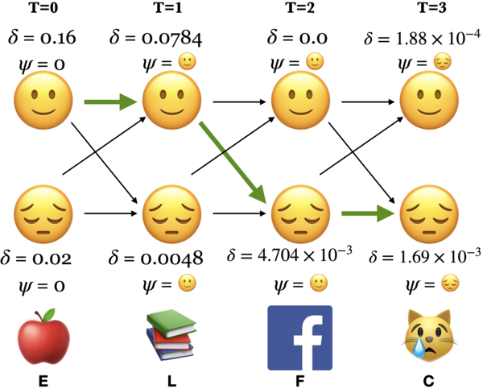

# Quiz 1 575 CS

## Language Models

- It computes the probability distribution of a sequence of words.
  - $P(w_1, w_2, ..., w_t)$
  - E.g. P("I have read this book) > P("Eye have red this book")
- Can also get the probability of the upcoming word.
  - $P(w_t | w_1, w_2, ..., w_{t-1})$
  - E.g. P("book" | "I have read this") > P("book" | "I have red this")

### Large Language Models

- Large language models are trained on a large corpus of text.

## Markov Model

- **High-level**: The probability of a word depends only on the previous word (forget everything written before that).
- **Idea**: Predict future depending upon:
  - The current state
  - The probability of change

### Markov Assumption

Naive probability of a sequence of words:
$$P(w_1, w_2, ..., w_t) = P(w_1)P(w_2|w_1)P(w_3|w_1, w_2)...P(w_t|w_1, w_2, ..., w_{t-1})$$

e.g. $$P(\text{I have read this book}) = P(\text{I})P(\text{have}|\text{I})P(\text{read}|\text{I have})P(\text{this}|\text{I have read})P(\text{book}|\text{I have read this})$$

Or simply:
$$P(w_1, w_2, ..., w_t) = \prod_{i=1}^{t} P(w_i|w_{1:i-1})$$

But this is hard, so in Markov model (n-grams), we only consider the `n` previous words. With the assumption:

$$P(w_t|w_1, w_2, ..., w_{t-1}) \approx P(w_t| w_{t-1})$$

### Markov Chain Definition

- Have a set of states $S = \{s_1, s_2, ..., s_n\}$.
- A set of discrete initial probabilities $\pi_0 = \{\pi_0(s_1), \pi_0(s_2), ..., \pi_0(s_n)\}$.
- A transition matrix $T$ where each $a_{ij}$ is the probability of transitioning from state $s_i$ to state $s_j$.

$$
T =
\begin{bmatrix}
    a_{11}       & a_{12} & a_{13} & \dots & a_{1n} \\
    a_{21}       & a_{22} & a_{23} & \dots & a_{2n} \\
    \dots \\
    a_{n1}       & a_{n2} & a_{n3} & \dots & a_{nn}
\end{bmatrix}
$$

- **Properties**:
  - $0 \leq a_{ij} \leq 1$
  - **rows sum to 1**: $\sum_{j=1}^{n} a_{ij} = 1$
  - columns do not need to sum to 1
  - This is assuming **Homogeneous Markov chain** (transition matrix does not change over time).

### Markov Chain Tasks

1. Predict probabilities of sequences of states
2. Compute probability of being at a state at a given time
3. Stationary Distribution: Find steady state after a long time
4. Generation: Generate a sequences that follows the probability of states

#### Stationary Distribution

- Steady state after a long time.
- Basically the eigenvector of the transition matrix corresponding to the eigenvalue 1.

$$\pi T = \pi$$

- Where $\pi$ is the stationary probability distribution
   
- **Sufficient Condition for Uniqueness**:
  - Positive transitions ($a_{ij} > 0$ for all $i, j$)
- **Weaker Condition for Uniqueness**:
  - **Irreducible**: Can go from any state to any other state (fully connected)
  - **Aperiodic**: No fixed period (does not fall into a repetitive loop)

### Learning Markov Models

- Similar to Naive Bayes, Markov models is just counting
- Given $n$ samples/ sequences, we can find:
  - Initial probabilities: $\pi_0(s_i) = \frac{\text{count}(s_i)}{n}$
  - Transition probabilities: $a_{ij} = \pi(s_i| s_j) = \frac{\text{count}(s_i, s_j)}{\text{count}(s_i)} = \frac{\text{count of state i to j}}{\text{count of state i to any state}}$

### n-gram language model

- Markov model for NLP
- `n` in n-gram means $n-1$ previous words are considered
  - e.g. `n=2` (bigram) means consider current word for the future
  - DIFFERENT from Markov model definition bigram= markov model with `n=1` (we normally use this definition in NLP)
- We extend the definition of a "state" to be a sequence of words
  - e.g. "I have read this book" -> bigram states: "I have", "have read", "read this", "this book"
- example: "I have read this book"
  - trigram (n=2): $P(\text{book} | \text{read this})$
  - n=3: $P(\text{book} | \text{have read this})$

_Note: n we use above is not the same as n in n-gram_

#### Evaluating Language Models

- Best way is to embed it in an application and measure how much the application improves (**extrinsic evaluation**)
- Often it is expensive to run NLP pipeline
- It is helpful to have a metric to quickly evaluate performance
- Most common **intrinsic evaluation** metric is **perplexity**
  - **Lower perplexity is better** (means better predictor of the words in test set)

#### Perplexity

Let $W = w_1, w_2, ..., w_N$ be a sequences of words.

$$
\text{Perplexity}(W) = P(w_1, w_2, ..., w_N)^{-\frac{1}{N}} \\
= \sqrt[N]{\frac{1}{P(w_1, w_2, ..., w_N)}}
$$

For `n=1` markov model (bigram):

$$P(w_1, w_2, ..., w_N) = \prod_{i=1}^{N} P(w_i|w_{i-1})$$

So...

$$
\text{Perplexity}(W) = \sqrt[N]{\prod_{i=1}^{N} \frac{1}{P(w_i|w_{i-1})}}
$$

- Increase `n` will decrease perplexity => better model
- Too high still bad because of overfitting

## Applications of Markov Models

### Google PageRank

- **Idea**: The importance of a page is determined by the importance of the pages that link to it.
- **Markov Model**: The probability of being on a page at time $t$ depends only on the page at time $t-1$.
- **Transition Matrix**: The probability of going from page $i$ to page $j$ is the number of links from page $i$ to page $j$ divided by the number of links from page $i$.
  - Add $\epsilon$ to all values so that matrix is fully connected
  - Normalize so sum of each row is 1
- **Stationary Distribution**: The stationary distribution of the transition matrix gives the importance of each page.
  - It shows the page's long-term visit rate

## Basic Text Preprocessing

- Text is unstructured and messy
  - Need to "normalize"

### Tokenization

- Sentence segmentation: text -> sentences
- Word tokenization: sentence -> words
  - Process of identifying word boundaries
- Characters for tokenization:
  | Character | Description |
  | --- | --- |
  | Space | Separate words |
  | dot `.` | Kind of ambiguous (e.g. `U.S.A`) |
  | `!`, `?` | Kind of ambiguous too |
- How?
  - Regex
  - Use libraries like `nltk`, `spacy`, `stanza`

### Word Segmentation

- In NLP we talk about:
  - **Type**: Unique words (element in vocabulary)
  - **Token**: Instances of words

### word-based vs character-based language models

| Feature       | Word-Based                                                                           | Character-Based                                                                              |
| ------------- | ------------------------------------------------------------------------------------ | -------------------------------------------------------------------------------------------- |
| Advantages    | - Faster training and inference due to smaller vocabulary size                       | - Can handle unseen words (out-of-vocabulary) and typos by generating characters             |
|               | - Leverages existing knowledge of grammar and syntax through word relationships      | - More flexible for generating creative text formats like code or names                      |
| Disadvantages | - Requires a large vocabulary, leading to higher memory usage and computational cost | - May struggle with complex morphology (word structure) in some languages                    |
|               | - Can struggle with unseen words or typos (resulting in "unknown word" tokens)       | - May generate grammatically incorrect or nonsensical text due to lack of word-level context |

- n-gram typically have larger state space for word-based models than character-based models

### Other Preprocessing Steps

- Removing stop words
- Lemmatization: Convert words to their base form
- Stemming: Remove suffixes
  - e.g. automates, automatic, automation -> automat
  - Not actual words, but can be useful for some tasks
  - Be careful, because kind of aggressive

### Other Typical NLP Tasks

- **Part of Speech (POS) Tagging**: Assigning a part of speech to each word
- **Named Entity Recognition (NER)**: Identifying named entities in text
- **Coreference Resolution**: Identifying which words refer to the same entity
- **Dependency Parsing**: Identifying the grammatical structure of a sentence

## Hidden Markov Models

### Speech Recognition

- Python has several libraries for speech recognition.
  - Have a module called `SpeechRecognition` which can access:
    - Google Web Speech API
    - Sphinx
    - Wit.ai
    - Microsoft Bing Voice Recognition
    - IBM Speech to Text
  - Might need to pay for some of these services
- **General Task**: Given a sequence of audio signals, want to recognize the corresponding phenomes/ words
  - **Phenomes**: Distinct units of sound
    - E.g. "cat" has 3 phenomes: "k", "ae", "t". "dog" has 3 phenomes: "d", "aa", "g"
  - English has ~44 phenomes
- It is a **sequence modeling problem**
- Many modern speech recognition systems use HMM
  - HMM is also still useful in bioinformatics, financial modeling, etc.

### HMM Definition and Example

- **Hidden**: The state is not directly observable
  - e.g. In speech recognition, the phenome is not directly observable. Or POS (Part of Speech) tags in text.
- HMM is specified by a 5-tuple $(S, Y, \pi, T, B)$
  - $S$: Set of states
  - $Y$: Set of observations
  - $\pi$: Initial state probabilities
  - $T$: Transition matrix, where $a_{ij}$ is the probability of transitioning from state $s_i$ to state $s_j$
  - $B$: Emission probabilities. $b_j(y)$ is the probability of observing $y$ in state $s_j$
- Yielding the state sequence and observation sequence

$$\text{State Sequence}:Q = q_1, q_2, ..., q_T \in S$$

$$\text{Observation Sequence}: O = o_1, o_2, ..., o_T \in Y$$

#### HMM Assumptions

1. The probability of a particular state depends only on the previous state

$$P(q_i|q_0,q_1,\dots,q_{i-1})=P(q_i|q_{i-1})$$

2. Probability of an observation depends **only** on the state.

$$P(o_i|q_0,q_1,\dots,q_{i-1},o_0,o_1,\dots,o_{i-1})=P(o_i|q_i)$$

**Important Notes**:

- Observations are ONLY dependent on the current state
- States are dependent on the previous state (not observations)
- Each hidden state has a probability distribution over all observations

#### Fundamental Questions for a HMM

1. Likelihood
   - Given $\theta = (\pi, T, B)$ what is the probability of observation sequence $O$?
2. Decoding
   - Given an observation sequence $O$ and model $\theta$. How do we choose the best state sequence $Q$?
3. Learning
   - Given an observation sequence $O$, how do we learn the model $\theta = (\pi, T, B)$?

#### HMM Likelihood

- What is the probability of observing sequence $O$?

$$P(O) = \sum\limits_{Q} P(O,Q)$$

This means we need all the possible state sequences $Q$

$$P(O,Q) = P(O|Q)\times P(Q) = \prod\limits_{i=1}^T P(o_i|q_i) \times \prod\limits_{i=1}^T P(q_i|q_{i-1})$$

This is computationally inefficient. $O(2Tn^T)$

- Need to find every possible state sequence $n^T$, then consider each emission given the state sequence $T$
- $n$ is the number of hidden states
- $T$ is the length of the sequence

To solve this, we use dynamic programming (Forward Procedure)

##### Dynamic Programming: Forward Procedure

- Find $P(O|\theta)$
- Make a table of size $n \times T$ called **Trellis**
  - rows: hidden states
  - columns: time steps
- Fill the table using the following formula:
  1. **Initialization**: compute first column ($t=0$)
     - $\alpha_j(0) = \pi_j b_j(o_1)$
       - $\pi_j$: initial state probability
       - $b_j(o_1)$: emission probability
  2. **Induction**: compute the rest of the columns ($1 \leq t < T$)
     - $\alpha_j(t+1) = \sum\limits_{i=1}^n \alpha_i(t) a_{ij} b_j(o_{t+1})$
       - $a_{ij}$: transition probability from $i$ to $j$
  3. **Termination**: sum over the last column ($t=T$)
     - $P(O|\theta) = \sum\limits_{i=1}^n \alpha_T(i)$
- It is computed left to right and top to bottom
- Time complexity: $O(2n^2T)$
  - At each time step, need to compare states to all other states $n^2$
  - Better compared to the naive approach $O(2Tn^T)$

### Supervised Learning in HMM

- Training data: Set of observations $O$ and set of state sequences $Q$
- Find parameters $\theta = (\pi, T, B)$

- Popular libraries in Python:
  - `hmmlearn`
  - `pomegranate`

### Decoding: The Viterbi Algorithm

- Given an observation sequence $O$ and model $\theta = (\pi, T, B)$, how do we choose the best state sequence $Q$?
- Find $Q^* = \arg\max_Q P(O,Q|\theta)$

|                             | Forward Procedure                                                                                                                         | Viterbi Algorithm                                                                                                             |
| --------------------------- | ----------------------------------------------------------------------------------------------------------------------------------------- | ----------------------------------------------------------------------------------------------------------------------------- |
| **Purpose**                 | Computes the probability of observing a given sequence of emissions, given the model parameters.                                          | Finds the most likely sequence of hidden states that explains the observed sequence of emissions, given the model parameters. |
| **Computation**             | Computes forward probabilities, which are the probabilities of being in a particular state at each time step given the observed sequence. | Computes the most likely sequence of hidden states.                                                                           |
| **Probability Calculation** | Sum over all possible paths through the hidden states.                                                                                    | Recursively calculates the probabilities of the most likely path up to each state at each time step.                          |
| **Objective**               | Computes the likelihood of observing a given sequence of emissions.                                                                       | Finds the most probable sequence of hidden states that explains the observed sequence of emissions.                           |

- Both are dynamic programming algorithms with time complexity $O(n^2T)$

- **Viterbi Overview**:
  - Store $\delta$ and $\psi$ at each node in the trellis
    - $\delta_i(t)$ is the max probability of the most likely path ending in trellis node at state $i$ at time $t$
    - $\psi_i(t)$ is the best possible previous state at time $t-1$ that leads to state $i$ at time $t$

#### Viterbi: Initialization

- $\delta_i(0) = \pi_i b_i(O_0)$
  - recall $b_i(O_0)$ is the emission probability and $\pi_i$ is the initial state probability
- $\psi_i(0) = 0$

#### Viterbi: Induction

- Best path $\delta_j(t)$ to state $j$ at time $t$ depends on each previous state and
  their transition to state $j$

- $\delta_j(t) = \max\limits_i \{\delta_i(t-1)a_{ij}\} b_j(o_t)$
  - $b_j(o_t)$ is the emission probability of observation $o_t$ given state $j$
- $\psi_j(t) = \arg \max\limits_i \{\delta_i(t-1)a_{ij}\}$

#### Viterbi: Conclusion

- Choose the best final state
  - $q_t^* = \arg\max\limits_i \delta_i(T)$
- Recursively choose the best previous state
  - $q_{t-1}^* = \psi_{q_t^*}(T)$

### The Backward Procedure

- We do not always have mapping from observations to states (emission probabilities $B$)
- Given an observation sequence $O$ but not the state sequence $Q$, how do we choose the best parameters $\theta = (\pi, T, B)$?
- Use **forward-backward algorithm**

#### Basic Idea

- Reverse of the forward procedure **right to left** but still **top to bottom**
- Find the probability of observing the rest of the sequence given the current state
  - $\beta_j(t) = P(o_{t+1}, o_{t+2}, \dots, o_T)$

#### Steps for Backward Procedure

1. **Initialization**: set all values at last time step to 1
   - $\beta_j(T) = 1$
2. **Induction**: compute the rest of the columns ($1 \leq t < T$)
   - $\beta_i(t) = \sum_{j=1}^N a_{ij}b_{j}(o_{t+1}) \beta_j(t+1)$
3. **Conclusion**: sum over the first column
   - $P(O|\theta) = \sum_{i=1}^N \pi_i b_i(o_1) \beta_i(1)$
