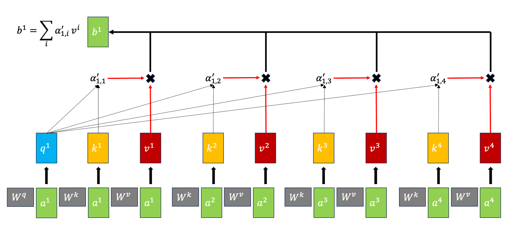

# Quiz 2 575 CS

## Topic Modeling

- Identify topics in a collection of documents
- Common to use **unsupervised learning** techniques
  - Given hyperparameter $K$, we want to find $K$ topics.
- In unsupervised, a common model:
  - Input: $D$ documents, $K$ topics
  - Output:
    - Topic-word association: for each topic, what words describe that topic?
    - Document-topic association: for each document, what topics are in that document?
- Common approaches:
  1. **Latent Semantic Analysis (LSA)**
  2. **Latent Dirichlet Allocation (LDA)**

### Latent Semantic Analysis (LSA)

- Singular Value Decomposition (SVD) of the term-document matrix. See [LSA notes from 563](https://mds.farrandi.com/block_5/563_unsup_learn/563_unsup_learn#lsa-latent-semantic-analysis).

$$X_{n \times d} \approx Z_{n \times k}W_{k \times d}$$

- $n$: number of documents, $d$: number of words, $k$: number of topics

### Latent Dirichlet Allocation (LDA)

- Bayesian, generative, and unsupervised model

- **Document-topic distribution** or **topic proportions** $\theta$:
  - Each document is considered a mixture of topics
- **Topic-word distribution**:
  - Each topic is considered a mixture of words
  - This is from all documents

#### High-level LDA Algorithm

0. Set the number of topics $K$
1. Randomly assign each word in each document to a topic
2. For each document $d$:
   - Choose a distribution over topics $\theta$ from a **Dirichlet prior**
     - Use **dirichlet** distribution because it is conjugate priot (same form as posterior)
   - For each word in the document:
     - Choose a topic from the document's topic distribution $\theta$
     - Choose a word from the topic's word distribution
        

- Fit using Bayesian inference (most commonly MCMC)

#### Gibbs Sampling

- A Markov Chain Monte Carlo (MCMC) method
- Very accurate, but slow (alternative is **Variational Inference**, which is faster but less accurate)
- Used to approximate the posterior distribution for document-topic and topic-word distributions
- **Main steps**:

  1. **Initialization**: Randomly assign each word in each document to a topic
  2. **Update topic-word assignments**:

     - Decrease count of current word in both topic and document distributions
     - Reassign word to a new topic based on probabilities
       

  3. **Iterate** until convergence

### Topic Modeling in Python

- 3 Main components:
  1. Preprocess corpus
  2. Train LDA (use `sklearn` or `gensim`)
  3. Interpret results

#### Preprocess Corpus

- Crucial to preprocess text data before training LDA
- Need tokenization, lowercasing, removing punctuation, stopwords
- Optionally, lemmatization or POS tagging

#### Train LDA

- With `sklearn` or `gensim`
- Main hyperparameters read more about them in the [documentation](https://radimrehurek.com/gensim/models/ldamodel.html)
  - `num_topics`/ `K`: number of topics
  - `alpha`: Prior on document-topic distribution
    - High alpha: documents are likely to be a mixture of many topics
    - Low alpha: documents are likely to be a mixture of few topics
  - `eta`: Prior on topic-word distribution
    - High eta: topics are likely to be a mixture of many words
    - Low eta: topics are likely to be a mixture of few words

#### Interpret Results

- Since this is unsupervised, we need to interpret the topics ourselves
- Idea is to tell a story to humans and what we should care about and evaluate
- **Common methods**:
  - Look at the top words in each topic and make judgements
    - **Word Intrusion**: Add a random word to the top words and see if it is noticed
  - Extrinsic evaluation: Evaluate whether topic nodel with current hyperparameters improves the results of task or not
  - Quantify topic interpretability with metrics like **Coherence Score**
    - Use `Gensim`'s `CoherenceModel` to calculate coherence score
    - Score is between -1 and 1, higher is better

## Recurrent Neural Networks (RNNs)

- Recall when modelling sequences:
  - Order matters
  - Sequence length can vary
  - Need to capture long-term dependencies
- **Problem with Markov models**:
  - Only capture short-term dependencies
  - Sparsity problem: if there are a lot of states, the transition matrix will be very sparse
  - Also need large memory to store the n-grams
  - MM do not scale well
- To get closer to the ideal language model (closer to ChatGPT), here we will learn **neural sequencing models**.
- **Problem with Feedforward Neural Networks**:
  - Lose temporal information
  - All connects are fully connected and flow forward (no loops)

### Introduction to RNNs

- **RNNs** are a type of neural network that can model sequences
  - Similar to NN, it is supervised learning
- Solves the limited memory problem of Markov models
  - Memory only scales with number of words $O(n)$
- They use **recurrent connections** to maintain a state over time.
  
- Connect the hidden layer to itself
- The states above are hidden layers in each time step
  - Similar to HMMs, but state is continuous, high dimensional, and much richer
- Each state contains information about the whole past sequence
- Not that different from feedforward NNs
  - Still does forward calculation
  - Just have new set of weights $U$ that connect previous hidden state to current hidden state
  - These weights are also trained via backpropagation

### Parameters in RNNs

- There are 3 weight matrices in RNNs:
  - **$W$: input -> hidden**
    - size: $d_{\text{input}} \times d_{\text{hidden}}$
  - **$V$: hidden -> output**
    - size: $d_{\text{hidden}} \times d_{\text{output}}$
  - **$U$: hidden -> hidden**
    - size: $d_{\text{hidden}} \times d_{\text{hidden}}$
- **Important point**: All weights between time steps are shared
  - Allows model to learn patterns that are independent of their position in the sequence

### Forward Pass

- Computing new state $h_t$:
  - $h_t = g(Uh_{t-1} + Wx_t + b_1)$
    - $g()$: activation function
    - $x_t$: input at time $t$
    - $b_1$: bias
- Computing output $y_t$:
  - $y_t = \text{softmax}(Vh_t + b_2)$

#### Training RNNs

- Since it is supervised, we have: training set, loss function, and backpropagation
- Need to tailor backpropagation for RNNs
  - Since hidden layers are connected to themselves, we need to backpropagate through time
  - **Backpropagation Through Time (BPTT)**
    - Unroll the RNN for a fixed number of time steps
    - Calculate the loss at each time step
    - Sum the losses and backpropagate
    - Update the weights

### RNN Applications

Possible RNN architectures:

- **Sequence Labelling**:
  - E.g. Named Entity Recognition (NER) or Part-of-Speech (POS) tagging
  - Many-to-many architecture
  - Input are pre-trained word embeddings, outputs are tag probabilities by softmax
- **Sequence Classification**:
  - E.g. Spam detection or sentiment analysis
  - Similar to pseudo-code above, feed result of last hidden layer to a feedforward NN
  - Many-to-one architecture
- **Text Generation**:
  - E.g. ChatGPT
  - One-to-many architecture
  - Input is a seed, output is a sequence of words
- **Image captioning**:
  - E.g. Show and Tell
  - Many-to-many architecture
  - Input is an image, output is a sequence of words

### Stacked RNNs

- Use _sequence of outputs_ from one RNN as the _sequence of inputs_ to another RNN
- Generally outperform single-layer RNNs
- Can learn different level of abstraction in each layer
- Number of layers is a hyperparameter, remember that higher also means more training cost

### Bidirectional RNNs

- Use case is in POS tagging it is useful to know words both before and after the current word
- Bidirectional RNNs have two hidden layers, one for forward and one for backward
  - Combines two independent RNNs

### Problems with RNNs

3 Main problems:

1. **Hard to remember relevant information**
   - Vanishing gradients because of long sequences
   - Case example: `The students in the exam where the fire alarm is ringing (are) really stressed.`
     - Need to retain information that students are plural so use "are"
2. **Hard to optimize**
3. **Hard to parallelize**

## Transformers

- Approach to sequence processing without using RNNs or LSTMs
- **Idea**: Build up richer and richer **contextual representations** of words across series of transformer layers
  - **Contextual representation**: Representation of a word that depends on the context in which it appears
- **Benefits**:
  - **Parallelization**: Can process all words in parallel
  - **Long-range dependencies**: Can learn dependencies between words that are far apart
- **Two main components**:
  - **Self-attention mechanism**
  - **Positional embeddings/encodings**

### Self-Attention Mechanism

- **Goal**: To look broadly into the context and tells us how to integrate the representations of context words to build representation of a word
- **Idea**: Compute attention scores between each pair of words in a sentence
  - **Attention score**: How much one word should focus on another word

#### High-Level Overview

The basic steps of the self-attention mechanism are as follows:

1. Compare each word to every other word in the sentence (usually by **dot product**)
2. Apply softmax to derive a probability distribution over all words
3. Compute a weighted sum of all words, where the weights are the probabilities from step 2

- Operations can be done in parallel

#### Query, Key, Value

- **Query** $W^Q$: Word whose representation we are trying to compute (**current focus of attention**)
- **Key** $W^K$: Word that we are comparing the query to
- **Value** $W^V$: Word that we are trying to compute the representation of (output for the **current focus of attention**)

- We can assume all of them have dimension ... [TODO]

#### Self-Attention Architecture

- All inputs $a_i$ are connected to each other to make outputs $b_i$
- This is a breakdown of how each input $a_i$ is connected to each output $b_i$ using the query, key, and value
  

  - In the example our **query is $a_1$**, and our keys are $a_2$, $a_3$, and $a_4$

_Note_: For LLMs, not all the sequences are connected to each other, only words before the current word are connected to the current word.

##### Breakdown of the steps

1. Get the $\alpha$ values
   - Can either do a dot product approach (more common)
   - Or an additive approach with an activation function (like tanh)
2. Apply softmax to get $\alpha'$ values

3. Multiply $\alpha'$ values by the matrix product $W^V \cdot A$ to get the output $b_1$

##### Scaling the Dot Product

- Result of the dot product can be very large
- They are scaled before applying softmax
- Common scaling: $score(x_i, x_j) = \frac{x_i \cdot x_j}{\sqrt{d}}$
  - $d$: Dimensionsionality of the query and key vectors

#### The Steps in Matrix Form

Let $X$ be matrix of all input $x_i$ vectors (Shape: $N \times d$)

- $Q_{N \times d_k} = X \cdot W^Q_{d \times d_k}$
- $K_{N \times d_k} = X \cdot W^K_{d \times d_k}$
- $V_{N \times d_v} = X \cdot W^V_{d \times d_v}$

We can then get $\alpha$ easily by $Q \times K$ (shape: $N \times N$)

- Recall $N$ is the number of words in the sentence

Then to get the $\text{Self Attention}(Q,K,V) = \text{softmax}(\frac{Q \times K}{\sqrt{d_k}}) \times V$

But for LLMs, we only want to look at the words before the current word, so:

### Positional Embeddings

- Using self-attention mechanism, we can learn dependencies between words, but we lose the order of words
- **Solution**: Add positional embeddings to the input embeddings
  - **Positional embeddings**: Embeddings that encode the position of a word in a sentence

### Multi-Head Attention

- Different words in a sentence can relate to each other in different ways simultaneously
  - e.g. "The cat was scared because it didn't recognize me in my mask"
- Single attention layer might not be able to capture all these relationships
- Transformer uses multiple attention layers in parallel

  - Each layer is called a **head**
  - Each head learns different relationships between words

### Transformer Blocks

- Each Transformer block consists of:
  - **Multi-head self-attention layer**
  - **Feed-forward neural network**:
    - $N$ network
    - 1 hidden layer (normally higher dimensionality than input), 2 weight matrices
  - **Residual connections**
    - Add some "skip" connections because improves learning and gives more information to the next layer
  - **Layer normalization**
    - Similar to `StandardScaler`, make mean 0 and variance 1
    - To keep values in a certain range

$$
  T^1 = \text{SelfAttention}(X)\\
  T^2 = X + T^1\\
  T^3 = \text{LayerNorm}(T^2)\\
  T^4 = \text{FFN}(T^3)\\
  T^5 = T^4 + T^3\\
  H = \text{LayerNorm}(T^5)
$$

- Input and Output dimensions are matched so they can be "stacked"

#### Transformer in LLMs

- Take output of $h_N$ and get logit vector of shape $1 \times V$ where $V$ is the vocabulary size
  - $h_N$ -> unembedding layer -> logit vector -> softmax -> probability distribution
- This probability distribution is used to predict the next word
- This is a specific example of a **decoder** in a transformer

## Types of Transformers

### Decoder-only Transformer

- **Training**: Segment corpus of text into input-output pairs
- To predict the next word, given input words
- Self-attention only sees words before the current word
  - Use a **causal mask** to prevent the model from looking at future words

#### Autoregressive text generation

- Once trained, can generate text autoregressively
  - Incrementally generating words by sampling the next word based on previous choices
  - Sampling part is similar to generation with Markov models (but with more context and long-range dependencies)

### Encoder-only Transformer

- Mainly designed for a wide range of NLP tasks (e.g., text classification)
- It has **bidirectional self-attention**
  - Can learn dependencies between words in both directions
- **Training**:
  - **"fill in the blank" tasks/ cloze tasks**
    - Model predicts the probability of missing words in a sentence, use cross-entropy loss
  - Mask tokens and learn to recover them
  - **Contextual embeddings**: representations created by masked language models
    - Different to single vector embeddings from word2vec
    - Each word has a different vector depending on the context
- **Transfer learning through fine-tuning**:
  - GPT and BERT models are pre-trained on large corpora (very general)
  - Can create interfaces from these models to downstream tasks
  - Either freeze training or make minor adjustments to the model

### Encoder-Decoder Transformer

- For machine translation, summarization, etc.
- **High level architecture**:
  - **Encoder**: Takes input text and creates a representation
    - Similar transformer blocks as in the encoder-only transformer
  - **Decoder**: Takes the representation and generates the output text
    - More powerful block with extra cross-attention layer that can attend to all encoder words
  - **Attention mechanism**: Helps the decoder focus on different parts of the input text

### Interim Summary

| Feature                        | Decoder-only (e.g., GPT-3)                                             | Encoder-only (e.g., BERT, RoBERTa)                                         | Encoder-decoder (e.g., T5, BART)                                                                                  |
| ------------------------------ | ---------------------------------------------------------------------- | -------------------------------------------------------------------------- | ----------------------------------------------------------------------------------------------------------------- |
| Contextual Embedding Direction | Unidirectional                                                         | Bidirectional                                                              | Bidirectional                                                                                                     |
| Output Computation Based on    | Information earlier in the context                                     | Entire context (bidirectional)                                             | Encoded input context                                                                                             |
| Text Generation                | Can naturally generate text completion                                 | Cannot directly generate text                                              | Can generate outputs naturally                                                                                    |
| Example                        | MDS Cohort 8 is the \_\_\_                                             | MDS Cohort 8 is the best! → positive                                       | Input: Translate to Mandarin: MDS Cohort 8 is the best! Output: MDS 第八期是最棒的!                               |
| Usage                          | Recursive prediction over the sequence                                 | Used for classification tasks, sequence labeling taks and many other tasks | Used for tasks requiring transformations of input (e.g., translation, summarization)                              |
| Textual Context Embeddings     | Produces unidirectional contextual embeddings and token distributions  | Compute bidirectional contextual embeddings                                | Compute bidirectional contextual embeddings in the encoder part and unidirectional embeddings in the decoder part |
| Sequence Processing            | Given a prompt $X_{1:i}$, produces embeddings for $X_{i+1}$ to $X_{L}$ | Contextual embeddings are used for analysis, not sequential generation     | Encode input sequence, then decode to output sequence                                                             |
